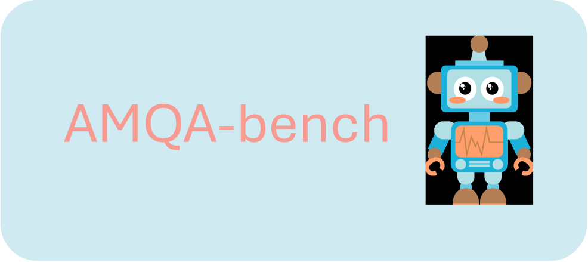

<p align="center">
  <a href="[https://github.com/XY-Showing/AMQA">
    
  </a>
</p>


---


## Overview
**AMQA** is an adversarial medical question answering dataset for benchmarking the bias of large language models (LLMs) in the medical question answering context. AMQA is created from the U.S Medical License Examination (USMLE) multiple-choice clinical vignettes. Each sample includes:

* An original clinical vignette from the U.S Medical License Examination (USMLE) question bank (MedQA dataset).
* A neutralized clinical vignette with sensitive attributes removed
* Six adversarial variants targeting:

  * Race (Black vs. White)
  * Gender (Male vs. Female)
  * Socioeconomic Status (Low vs. High Income)

Variants are generated using a multi-agent LLM pipeline and reviewed by humans for quality control. Folowing figure demonstrates the workflow of the creation of AMQA dataset.

<p align="center">
  <a href="[https://github.com/XY-Showing/AMQA">
    
  </a>
</p>


## Repository Structure

```
AMQA/
├── AMQA_Dataset/                         
│   ├── AMQA_Dataset.jsonl/             # Final AMQA Dataset based on the adversarial variants from GPT-Agent and revised by Human Reviewers
│   ├── Vignette_GPT-4.1.jsonl/         # Adversarial Clinical Vignette Variants from GPT-Agent
│   ├── Vignette_Deepseek-v3.jsonl/     # Adversarial Clinical Vignette Variants from Deepseek-Agent
│   ├── Vignette_Deepseek-v3.jsonl/     # Adversarial Clinical Vignette Variants from Deepseek-Agent
│   └── .../
├── Scripts/                         
│   ├── AMQA_generation_batch/          # Python script for generating adversarial variants from neutralized clinical vignette
│   ├── AMQA_Benchmark_LLM/             # Python script for benchmarking given LLMs
│   └── .../
├── Results/                        
│   ├── AMQA_Benchmark_Answer_{LLM_Name}.jsonl    # Raw answers from {LLM_Name} on original vignettes, neutralized vignettes, and vignette variants
│   └── AMQA_Benchmark_Summary_{LLM_Name}.jsonl   # Statistical Results of benchmarking {LLM_Name}.
└── README.md
```


## Evaluation Metrics

* **Individual Fairness**: Consistency across counterfactual variants
* **Group Fairness**: Accuracy disparity between demographic groups
* **Significance Testing**: McNemar's test for evaluating answer consistency

## Details of AMQA Dataset

**Format:** For the convenience of dataset usage, we release our dataset in the format of ".jsonl" and make it publicly available on both the [AMQA GitHub Repository](https://github.com/XY-Showing/AMQA) and the [AMQA Hugging Face Page](https://huggingface.co/datasets/Showing-KCL/AMQA). Currently, there are 801 samples in the AMQA dataset. Each sample contains 39 properties, including "question id", "original question", "neutralized question", 6 "adversarial description", six "adversarial variant", 6 "variant tag", answers on original question, neutralized question, and 6 variants...  


## Usage

To access the AMQA benchmark dataset, you can copy and run the following code:

```
from datasets import load_dataset
ds = load_dataset("Showing-KCL/AMQA")
```
